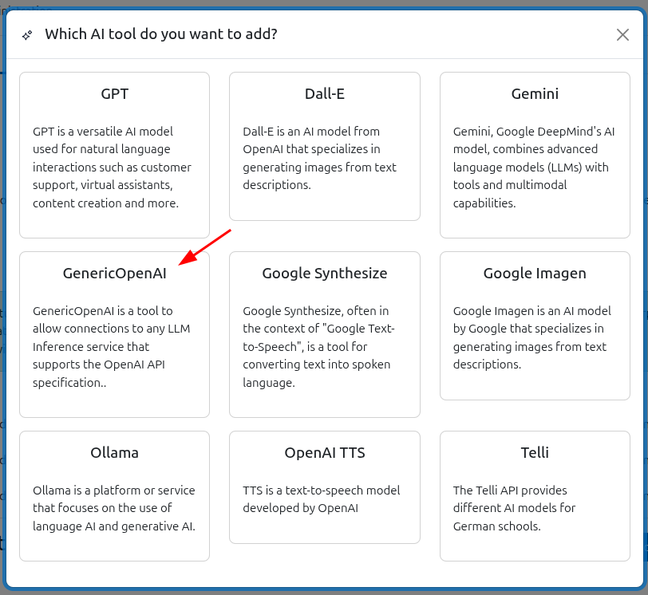

# Generic OpenAI Tool

## Overview
The Generic OpenAI Tool is a plugin for the local_ai_manager from https://github.com/bycs-lp/moodle-local_ai_manager. It is a clone of the chatgpt tool except the endpoint and model can be customised.
This means it can work with any service that implements the OpenAI standard.

## Why use this instead of the ChatGPT tool?

The built-in ChatGPT tool limits you into OpenAI's API endpoint and a fixed list of models. This plugin removes both restrictions:

- **Any OpenAI-compatible endpoint** — point it at Ollama, LM Studio, LocalAI, vLLM, Mistral AI, Groq, Together AI, or any other service that implements the OpenAI chat completions API. The chatgpt tool hardcodes `https://api.openai.com/v1/chat/completions`; here you type whatever URL you need.
- **Any model name** — the chatgpt tool presents a dropdown of known OpenAI models. This plugin replaces that with a free-text field so you can enter any model identifier your chosen provider supports (e.g. `llama3`, `mistral-7b`, `deepseek-r1`).

- **Future-proof** — new OpenAI models or third-party providers work immediately without waiting for a plugin update, because the model name is not hardcoded.

The trade-off compared to the chatgpt tool is that Azure OpenAI Service integration is not included. If you need Azure, use the chatgpt tool. For everything else, this plugin gives you full flexibility.
